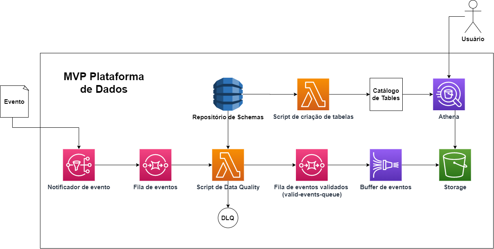

# data-challenge

Este teste é composto por três exercícios. Nos exercícios 1 e 2 você
será avaliado pela qualidade, otimização e eficiência do código e, no
exercício 3, pelo desenho de arquitetura. 

Uma empresa financeira está iniciando sua jornada em dados. Em um
primeiro momento decidiram investir na criação de um MVP de uma
plataforma de dados, utilizando serviços da AWS (Fig. 1), para validar o
seu potencial. Atenta às boas práticas na construção de plataformas como
essa, a empresa adotou desde o início o princípio de analytics by
design: todos os produtores de informações se adaptaram para enviar
eventos à plataforma com o seu layout já definido e documentado.

1.  O seu time ficou responsável pela construção desse fluxo de ingestão
    de dados e você pelo módulo de Data Quality deste fluxo. Este módulo
    vai escutar uma fila, validar os eventos trafegados nela a partir de
    JSONs Schemas armazenados em um repositório, e enviar para uma outra
    fila (valid-events-queue).\
    \
    Construa esse módulo em python a partir dos arquivos
    disponibilizados para você na pasta "exercicio1". Você pode ficar à
    vontade para propor melhorias, mas fique atento aos pontos a seguir:

    -   Use o JSON Schema disponibilizado na pasta do exercício
        (schema.json) para validar o evento, sem o auxílio de
        bibliotecas externas de validação, e garantindo que:

        i.  Tipo do campo do evento deve bater com o do schema.

        ii. Não deve aceitar campos não cadastrados no schema.

    -   Evento de saída deve ser igual ao de entrada.

    -   Desenvolva seu código no arquivo "event_validator.py". É a
        função "handler" deste arquivo que será estimulada sempre que um
        novo evento cair na fila e utilize a função
        "send_event_to_queue" para enviar eventos.

    -   Execute \'python main.py\' para simular o fluxo.

2.  É muito comum que os usuários da plataforma queiram fazer análises
    exploratória nos eventos armazenados na plataforma de dados. Você
    teve a ideia de construir um módulo que automatiza a criação de
    tabelas no AWS Athena a partir do mesmo JSON Schema utilizado no
    módulo de Data Quality.\
    \
    Construa esse módulo em python a partir dos arquivos
    disponibilizados para você na pasta "exercicio2" e garanta que ele
    crie queries de create table com todos os campos e tipos declarados
    no schema. Fique atento aos seguintes pontos:

    -   Utilize o arquivo "json_schema_to_hive.py" para desenvolver seu
        código e a função "create_hive_table_with_athena" para criação
        da tabela.

    -   Consulte a documentação de CREATE TABLE no Athena
        (<https://docs.aws.amazon.com/athena/latest/ug/create-table.html>)

    -   Execute \'python main.py\' para simular.

3.  O projeto vingou! A área de negócio identificou muitas oportunidades
    nos dados disponibilizados. Você ficou responsável por propor um
    desenho de arquitetura, não exaustivo, de uma plataforma de dados.
    Não se prenda na solução feita no MVP, essa plataforma pode ser
    construída usando tanto serviços de provedores cloud como soluções
    open-source. Use o Draw.io, se quiser, e se atente ao seguintes
    requisitos:

    -   Solução de ingestão

    -   Pipeline etl

    -   Soluções de armazenamento

    -   Catálogo de Dados

4. Assim que o novo data lake foi inaugurado, os usuários que fazem a gestão dos produtos da empresa nos pediram para ter uma visão da média do valor transacionado por cliente, por dia e por tipo de transação (pix, p2p e boleto). Crie uma consulta em SQL para extrair essa informação com a seguinte estrutura:

    costumer_id | account_id | name | date | transaction_type | mean_value 

    As tabelas com essas informações estão documentadas no arquivo challenge_table.xlsx na pasta exercicio4.

5. O uso do data lake vem crescendo muito e não tem sido eficiente realizar as consulas direto nessas tabelas. Por isso, vamos criar um DW para facilitar consultas de movimentações financeiras. Proponha um diagrama das tabelas para esse DW que facilite o seu uso.
