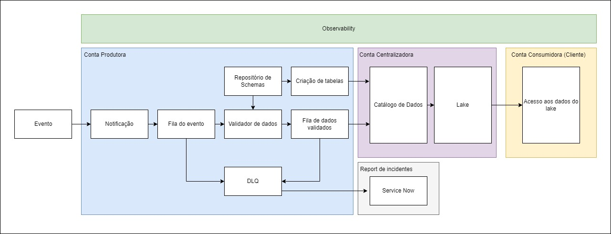

# Explicação do desenho
## Sobre a abordagem
Assim como conversado durante  o primeiro bate-papo, foi identificado o meu viés em relação às soluções do banco. Sendo assim, aproveitei a arquitetura proposta pelo MVP e incorporei com a estratégia de contas Producer e Consumer, centralizando os dados em uma conta Control.

## Sobre o desenho
Aproveitei a abordagem do MVP e apenas complementei com uma visão. Inicialmente, pensei em ter três contas:
    -> Produtora: ficaria a inteligência do Data Quality da Plataforma de Dados.
    -> Centralizadora: ficaria o catálogo de dados e informações centralizadas
    -> Consumidora: ficaria disponível para o usuário aplicar pipelines e transformações que desejasse

Na conta produtora, eu mantive o fluxo de tratativa do evento, enviando para uma fila todos os eventos que chegassem, com um componente fazendo o Data Quality para entender se é uma nova tabela ou se é uma atualização de dados. Este componente consulta o repositorio de schemas dentro da conta Producer, mas entendo que poderia ser uma consulta direto no Catálogo de Dados ou em um repositório na conta centralizadora. 

Após validados os dados, esses procedem para haver uma criação de tabela ou apenas um enriquecimento de um dado já existente. Mas antes de serem criadas, os metadados (colunas, referência de origem e destino, etc.) passam pela catalogação do Catálogo de Dados (podemos usar um Glue Data Catalog para cadastrar esseas informações). Após serem catalogados, esses dados seriam enviado para um Lake centralizado ainda na conta Centralizadora (poderíamos utilizar o Lake Formation para tal finalidade, pois poderíamos ter os dados governados e seguros)

Depois que os dados estiverem catalogados, pensei em disponibilizar o acesso para contas consumidoras através de regras de concessão de acesso. Dessa forma, os analistas das contas Consumidoras teriam esses dados disponíveis em sua conta quando quisessem. Nesse passo, seria interessante ter regras que replicam esses dados do Lake em uma interface user friendly (poderia ser um Athena) para que os analistas de negócio sintam-se confortáveis

## Conclusão
Acredito que minha visão tenha ficado bastante enviesada pelo meu contexto de trabalho atual e meus estudos estarem muito voltados para essa abordagem, visando atingir as expectativas do dia a dia da minha atuação. Acredito que, como o iti tem uma arquitetura diferente, será necessário bastante estudo e mudar o plano de evolução para atingir o patamar esperado, algo que não vejo como problema, mas sim como oportunidade.